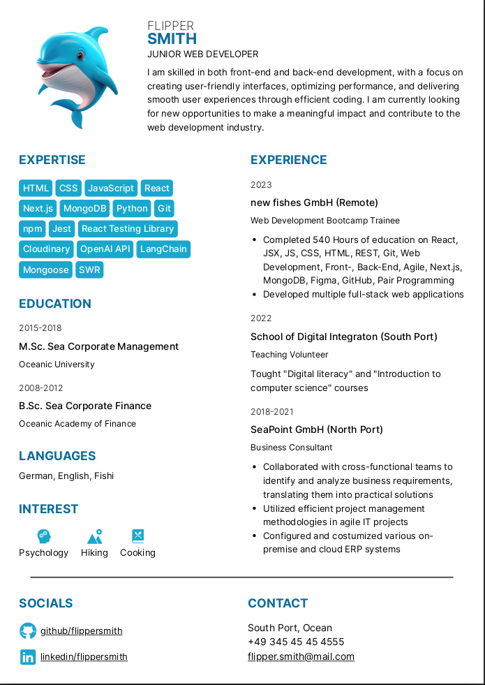

# CV template for a junior web developer



## Installation

```bash
git clone git@github.com:nastiche/cv-template-junior-web-developer.git
```

## Open HTML file

Open index.html in your browser to see the template (dotted page border is not seen later in the PDF file)

## Change the color palette

Replace given color variables with your color palette

```css
:root {
  --primary-color: #0d6c9c;
  --secondary-color: #18a8cd;
  --text-color: #000000;
  --black-color: #000000;
  --white-color: #ffffff;
}
```

## Change the profile image shape

You can crop your image into a circular shape by changing its border radius:

```css
.profile_container img {
  height: 190px;
  width: 190px;

  /* border radius for square image */
  /* border-radius: 3rem; */

  /* border radius for round image */
  border-radius: 100%;
}
```

## Replace dummy links!

Remember to replace dummy links (href attribute) in the Socials and Contact sections with your own ones

## Change icons in the Interest and Socials sections

You can use icons from the https://icons8.com/ (iOS16 Filled style)

## Add more pages

You can add more pages with `<div class="page"></div>`:

```html
<body>
  <!-- 3 Pages -->
  <div class="page">Page 1</div>
  <div class="page">Page 2</div>
  <div class="page">Page 3</div>
</body>
```

## Save to PDF

1. Open in Chrome (Recommended)
2. Press `Ctrl+P` or `Cmd+P`
3. Change the destination to `Save as PDF` (you might also need to set Margins to "none" and Options to "Background graphics" in the Print dialogue box)
